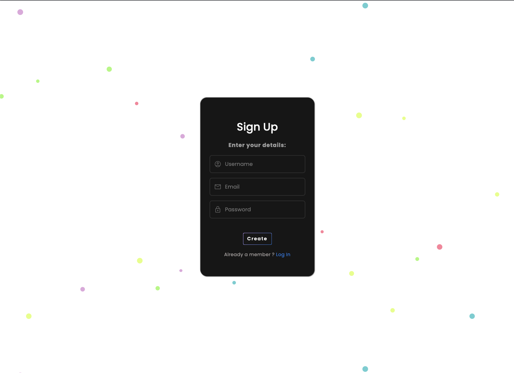

# Mood Tracker


Mood Tracker! is a free and open source web app app that aims to help you understand your emotion and feelings better. Track your emotional landscape, keep a mood journal,and gain new insights into yourself. It's simple to use with a interactive user interface. <p>
This application gives you a option to add a comment about your current mood or feelings like Happy, Sad, Neutral, Unsure. After you done commenting and you choose a memoji respectively. It will display your data with a date and time you posted so can keep track on your mood journal.

## User Story

```
AS A user
- I WANT to keep records of my day to day and time to time mood on every moment.
- SO THAT I can track present and past mood that is only available to myself.
```

## Acceptance Criteria

```
GIVEN I am tracking my mood
WHEN I enter the mood tracker and click the Enter button.
THEN I am presented with Sign Up page where I can create a personal account using my email and password.
WHEN I click on Create button on Sign Up page
THEN I am presented with a Login Page
WHEN I enter the Login Page
THEN I am presented with option to Login into my account using my email and password.
WHEN I click on Login button
THEN I should see the my profile dashboard where I get the option to take note and choose the memoji emotion like happy, sad, neutral, unsure.
```

# Output

### 1. Welcome Page


#

### 2. SignUp Page



#

### 3. Login Page


### 3. Login Page


#

## Table of Contents

- [Installation](#installation)
- [Usage](#usage)
- [Links](#links)
- [License](#license)
- [Contributing](#contributing)
- [Credits](#Credits)
- [Questions](#questions)

#

# Installation

The user may clone this repository from GitHub. This application requires Node.js, Express.js, Sequelize, mysql2, connection-session/express-session, nodemailer, moment, dotenv, bcrypt, express-handlebars. If cloning the repo, run npm i to run all modules. To connect to the database run mysql -u root -p and enter password from .env file(need to create .env file in root folder first). Then source the schema.sql. To connect to the server run npm start.

# Usage

This application will allow users to sign up if they are not a member, then once they are logged in they are able to view their user profile, and able to use dashboard section to keep track of their mood journal. User will able to save their mood journal as well as delete it if necessary.
Please view the site hosted on the Heroku platform - [Mood Tracker](https://trackmymood.herokuapp.com)

# Links

Below is the link related to the project:

- Deployed application - [Click Here](https://trackmymood.herokuapp.com)

- GitHub repository - [Click Here](https://github.com/rochak-ms/mood_tracker.git)

# License


Please visit [Here](https://mit-license.org/) for detail information.

# Contributing

- Rochak: https://github.com/rochak-ms
- Mitchell: https://github.com/mtchrrs
- Tam: https://github.com/Thanhtam84

# Tests

```
none
```

## Questions

If you have any questions about the project, please contact me at rochak.ms@gmail.com. Or you can find me [Here](https://github.com/rochak-ms) on GitHub.

#

`© 2022 Mood Tracker! -- Group-2(Rochak, Mitchell, Tam) Project-2`
